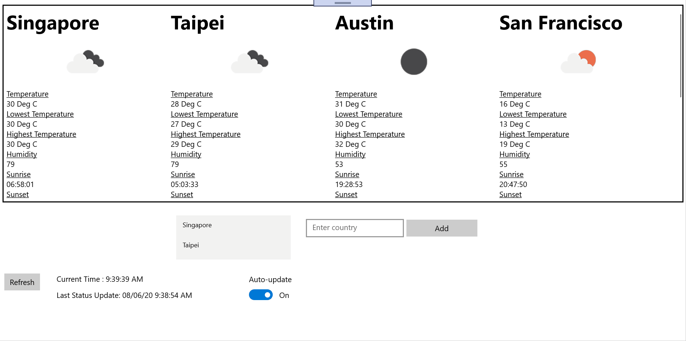

# Weather App
Weather App is a built as a Universal Windows Platform application with the primary objective to display weather data from OpenWeather API
for selected countries.

The application updates a local cache file every minute and will continue to display the last updated weather data 
from the cache.

Functionalities includes :
* Interval update of Weather data
* Offline data
* Adding Countries

# Prerequisites
As UWP is a dedicated program for Windows 10, it is ideal to run the application on the Windows 10 operating system

- Visual Studio | Redistributables
- Local Administrator account
- Windows 10

# Instructions

1. Download and install Visual Studio Community edition from [here](https://visualstudio.microsoft.com/)
1. Clone the repository or extract the ZIP
1. Start Microsoft Visual Studio 2020 and select File > Open > Project/Solution or double-click the Visual Studio Solution (.sln) file
If dependencies are required, add NuGet package for Newtonsoft.Json [Installing and using NuGet in VS2020](https://docs.microsoft.com/en-us/nuget/quickstart/install-and-use-a-package-in-visual-studio)
1. Press Ctrl+Shift+B, or select Build > Build Solution.
1. Run application in VS2020 as **Local Machine**

### If Required
```
1. Enable Developer Mode under Windows Settings > Update & Security > For Developers > Enable Developer Mode (Yes if prompted)
```

# Usage
**If gridview is empty or country list is not updated, please click on refresh to retrieve the API and update the control**
1. Enter country to add in the text field
1. Click on add country, if country exists, a message box will be prompted
1. Click on refresh to fetch the added country into the grid


# Roadmap
- [x] For each city display the current, low, and high temperatures, the humidity, and sunrise/sunset times
- [x]	The app has a refresh button that allows the weather to be updated
- [x]	Display the timestamp for when the weather data was captured from the weather API
- [x]	Include graphics to display weather updates for each city
- [x]	Ability to add and/or remove cities in the display list

# Built With
- Universal Windows Platform
- Package: Newtonsoft.Json


